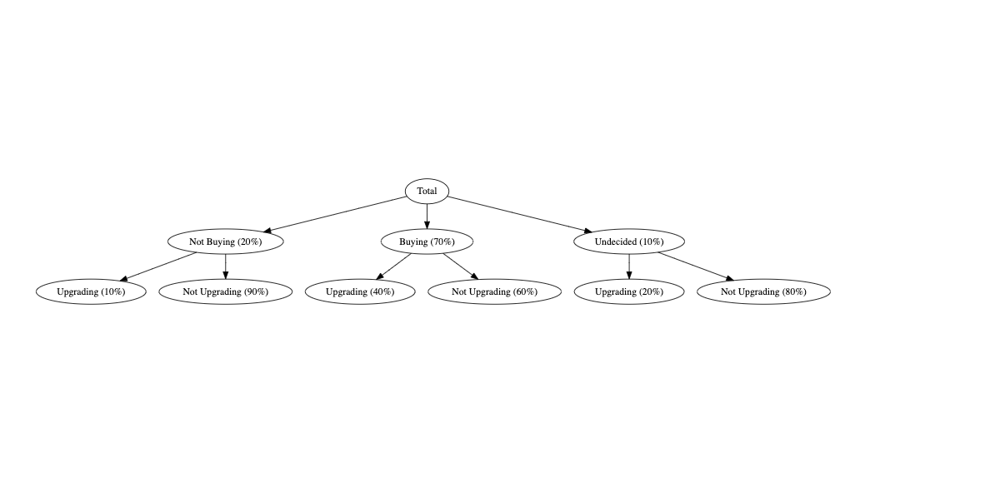

1.  An email message can travel through one of three server routes. The
    percentage of errors in each of the servers and the percentage of
    messages that travel through each route are shown in the table
    below. Assume that the servers are independent.

<!-- -->

    server_data <- data.frame(
      Server = c("Server 1", "Server 2", "Server 3"),  # Add a column for server names
      Percentage_Messages = c(40, 25, 35),
      Percentage_Errors = c(1, 2, 1.5)
    )
    server_data

    ##     Server Percentage_Messages Percentage_Errors
    ## 1 Server 1                  40               1.0
    ## 2 Server 2                  25               2.0
    ## 3 Server 3                  35               1.5

Using the given data, answer the following:

1.  What is the probability of receiving an email containing an error?

<!-- -->

    P_E <- sum(server_data$Percentage_Messages/100 * server_data$Percentage_Errors/100)
    P_E

    ## [1] 0.01425

1.  What is the probability that a message will arrive without error?

<!-- -->

    P_NE <- sum(server_data$Percentage_Messages/100 * (1-server_data$Percentage_Errors/100))
    P_NE

    ## [1] 0.98575

1.  If a message arrives without error, what is the probability that it
    was sent through Server 1?

<!-- -->

    P_S1_given_Ec <- ((1 - (server_data$Percentage_Errors[1]/100)) * (server_data$Percentage_Messages[1]/100)) / 
                     sum((1 - (server_data$Percentage_Errors/100)) * (server_data$Percentage_Messages/100))

    P_S1_given_Ec

    ## [1] 0.4017246

1.  A software company surveyed managers to determine the probability
    that they would buy a new graphics package that includes
    three-dimensional graphics. About 20% of office managers were
    certain that they would not buy the package, 70% claimed that they
    would buy, and the others were undecided. Of those who said that
    they would not buy the package, only 10% said that they were
    interested in upgrading their computer hardware. Of those interested
    in buying the graphics package, 40% were also interested in
    upgrading their computer hardware. Of the undecided, 20% were
    interested in upgrading their computer hardware.

Let *A* denote the intention of not buying, *B* the intention of buying,
*C* the undecided, and *G* the intention of upgrading the computer
hardware.

$$
\begin{enumerate}
    \item\[(a)\] Calculate the probability that a manager chosen at random will not upgrade the computer hardware \\ P(G^c) \\.
    \item\[(b)\] Explain what is meant by the posterior probability of \\ B \\ given \\ G \\, \\ P(B | G) \\.
    \item\[(c)\] Construct a tree diagram and use it to calculate the following probabilities:
    \begin{itemize}
        \item \\ P(G) \\
        \item \\ P(B | G) \\
        \item \\ P(B | G^c) \\
        \item \\ P(C | G) \\
        \item \\ P(C | G^c) \\
    \end{itemize}
\end{enumerate}
$$
A.

    P_A <- 0.20  
    P_B <- 0.70  
    P_C <- 0.10  

    P_G_A <- 0.10  
    P_G_B <- 0.40 
    P_G_C <- 0.20  

    # Compute P(G) using Law of Total Probability
    P_Gc <- 1 - ((P_G_A * P_A) + (P_G_B * P_B) + (P_G_C * P_C))
    P_Gc

    ## [1] 0.68

1.  

<!-- -->

    P_B_G <- (P_G_B * P_B) /(1- P_Gc)
    P_B_G

    ## [1] 0.875

This means that if a manager is upgrading their computer hardware, the
probability that they originally intended to buy the graphics package is
87.5%.

1.  

<!-- -->

    # Create the tree structure
    root <- Node$new("Total")

    # Add first level: Buying, Not Buying, Undecided
    A <- root$AddChild("Not Buying (20%)")
    B <- root$AddChild("Buying (70%)")
    C <- root$AddChild("Undecided (10%)")

    # Add second level: Upgrading vs Not Upgrading (Fix applied)
    A_Upg <- A$AddChild("Upgrading (10%)")
    A_Upg$prob <- 0.10
    A_NotUpg <- A$AddChild("Not Upgrading (90%)")
    A_NotUpg$prob <- 0.90

    B_Upg <- B$AddChild("Upgrading (40%)")
    B_Upg$prob <- 0.40
    B_NotUpg <- B$AddChild("Not Upgrading (60%)")
    B_NotUpg$prob <- 0.60

    C_Upg <- C$AddChild("Upgrading (20%)")
    C_Upg$prob <- 0.20
    C_NotUpg <- C$AddChild("Not Upgrading (80%)")
    C_NotUpg$prob <- 0.80

    # Assign probabilities for A, B, C
    A$prob <- 0.20
    B$prob <- 0.70
    C$prob <- 0.10

    # Convert to DiagrammeR format and plot
    tree_diagram <- ToDiagrammeRGraph(root)
    DiagrammeR::render_graph(tree_diagram)

    ## file:////private/var/folders/3j/cj97td3x5gnfmcxndylbnp2w0000gn/T/Rtmp1IZvhD/file128dd3fca77cf/widget128dd57fd7c1.html screenshot completed

*P*(*G*) =

    P_G <- (A_Upg$prob * A$prob) + (B_Upg$prob * B$prob) + (C_Upg$prob * C$prob)
    P_G

    ## [1] 0.32

*P*(*B*|*G*) =

    P_B_given_G <- (B_Upg$prob * B$prob) / P_G
    P_B_given_G

    ## [1] 0.875

*P*(*B*|*G**c*) =

    P_Gc <- 1 - P_G
    P_B_given_Gc <- (B_NotUpg$prob * B$prob) / P_Gc
    P_B_given_Gc

    ## [1] 0.6176471

*P*(*C*|*G*) =

    P_C_given_G <- (C_Upg$prob * C$prob) / P_G
    P_C_given_G

    ## [1] 0.0625

*P*(*C*|*G**c*) =

    P_C_given_Gc <- (C_NotUpg$prob * C$prob) / P_Gc
    P_C_given_Gc

    ## [1] 0.1176471

1.  A malicious spyware can infect a computer system through the
    Internet or through email. The spyware comes through the Internet
    70% of the time and 30% of the time, it gets in through email. If it
    enters via the Internet, the anti-virus detector will detect it with
    probability 0.6, and via email, it is detected with probability 0.8.

<!-- -->

1.  What is the probability that this spyware infects the system?

<!-- -->

    P_I <- 0.7  
    P_E <- 0.3  

    P_D_I <- 0.6  
    P_D_E <- 0.8  

    P_Inf <- ((1-P_D_I) * P_I) + ((1-P_D_E) * P_E)
    P_Inf

    ## [1] 0.34

1.  If the spyware is detected, what is the probability that it came
    through the Internet?

<!-- -->

    P_I_D <- (P_D_I * P_I) / ((P_D_I * P_I) + (P_D_E * P_E))
    P_I_D

    ## [1] 0.6363636
