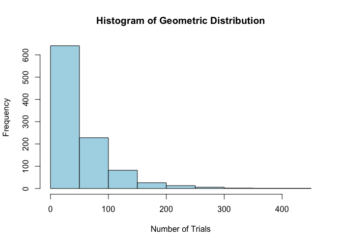

I. Geometric Distribution. Provide an R code for the geometric
distribution. The geometric distribution is a probability distribution
that models the number of trials required to achieve the first success
in a sequence of Bernoulli trials, where each trial has a constant
probability of success.

1.  Set the probability of success: p &lt;- 0.2

2.  Generate 1000 random variables from the geometric distribution.

3.  Calculate some basic statistics:

mean\_x &lt;- mean(x)

var\_x &lt;- var(x)

sd\_x &lt;- sd(x)

1.  Print the results in item 3 with the following output (string):

Number of trials required to achieve first success:

Mean (in 2 decimal places):

Variance (in 2 decimal places):

Sandard deviation ( in 2 decimal places):

1.  Plot the histogram of the results.

<!-- -->

    x <- rgeom(1000, 0.02)
    x

    ##    [1]  12   2  60 157  22  15 135  62  41  22  83  23  95  21  41  47   6  81
    ##   [19]  26  21  12  58  38   8  89   0  71  23   1  43  17  17   0   5  18  34
    ##   [37]   2  92  21 135   2  71 155  69  40   7 119  14  31  22  54  30 170  46
    ##   [55]  77   9  42  11  93 124  39 247  33  57  79  35  29  22 191  14   5   0
    ##   [73] 124  36  96  65  17  22  20  56  71  34 142   6 146   5  60  23 434  59
    ##   [91]  29  25  29  30  12  10   7   4  28 181  30 138  12  78  27  16  13  48
    ##  [109]  62 162  67  13  25 143   3  73 120  26 119  71  99  52  91  14   6  94
    ##  [127]   2  27   9   1  53   8   0 112  15  23  71  16 210  10  86  90 169  40
    ##  [145]  70  12  21   8  53  21 100  24  35  42  18  54  47  37  63  22  27  82
    ##  [163] 192  99  73  40  28  72  42 144   6  67  71   1  45   7  29 256  12  20
    ##  [181]  22  21   3   7  36 196  76 152  50   9   2 248  48  12  33 192  35   1
    ##  [199]  11  42   3  12   2  28  19  35  26 117  13  66 150   6   7  18  26  18
    ##  [217]   2  75   4  92  12  27 219  28   1  25  51   1 105  51  13 262 136  32
    ##  [235]  17  25   0  61 185  51  34   2  10 117 138   4  26  45   3   5 141  23
    ##  [253]  61   1  47  28 137  27  33   9  13  34  14  10  21 111 132   5 189 104
    ##  [271]  21  12  26  70  25  12  77  44  31 145  73  23 241  97 189   0   9  81
    ##  [289]   5 103 204  89  56 114  27  38  30  42  27  97  19  44  43  45   0  22
    ##  [307] 116  77   9  48  59  11  60   2  72  52  10  59   3  52  38  34   1  40
    ##  [325]   7  48  88  28   3  12  25   7 128   9  64  90  13  46  89  43  17  10
    ##  [343]  44  61   5 120  82  44  37  84  13  18  67  21  26   9  45  42  21   7
    ##  [361]   5  12  13 169  44  36  10 111   0  12 104 144   6   6  55 110 108  39
    ##  [379]  40  47 129  60  85  96 119  77   9  51  33  23  39  28  78  14  69  27
    ##  [397]  41  23  22  18  13   5  47  17   5  76  27  31  38 109  16   2  46  15
    ##  [415]  11 111  74  67  82   1  39  12   5  16  53  74  29 218  39  24   7 239
    ##  [433]  41  12  11   0  20  62  66  12  79  56  18   3  28  33   3  16  74   9
    ##  [451]   7   5 121   7 109 142  31  23  82  11  21   9  10  33  32   1  11  45
    ##  [469]  29  88 117  71  21   9  72  66   4   4  87  12 189  11  46  52   2  94
    ##  [487]   6   0   4  18  18  10  31  53 112  88  42   8 104  43  12 130  76 131
    ##  [505]  82   3  22  18  13  74  37   2  22  45   9 119  13  19  28 329  40  24
    ##  [523]  15  39  65   1  23  57 105  98  75  45   9   5   9   8  85  61 214   0
    ##  [541]  39  31  67 110   0  16 111  21  82  88   2  17  19  28  87  18  38  12
    ##  [559]   5  19   7  13  25  88  15  13   0   8  89  66  41 135  11 122  65  97
    ##  [577]   0   2   8  27  50  22   3   9 137  46  97  28  41  53  64  51  95  24
    ##  [595]  41  12  30  20  32  47  25  33  34  50  11  48  36  93  42   6   7  15
    ##  [613]  26  26  12  72  89  46   8  31  79  73  37   3   5  29   6  72  68  11
    ##  [631]  34  19   1 153  49   0  23  21  15  74  12  16  25  15 115 141  99  22
    ##  [649]  81  62  46 179   9   7  11  56 103  12  75 202  14   0  79  37   8  78
    ##  [667]   2  16  93  63  31  65  16 165  15  69  33   9  60  18  33 177  69  33
    ##  [685] 201  46 269  94  60  28  86  29  90  48   2   4  20  12   5 285   6  12
    ##  [703]  60  79   4  10  68  13  74   4  90  53  14  48  21  68  14  14  18  69
    ##  [721]  51 147 113  94  50  76 156  27  33  47  63  10  10  36  47  67  19  51
    ##  [739]  15  51  47  95  58  70  80  49  16   2  17   8  23  11   5  43  84 134
    ##  [757]   6  15  13  24  26  13  82  77  43  97 105  42  44  23 105   2 136  41
    ##  [775]   1  41  67 133  31  53   1  45  42   6   1  15  38 164  33  16 145   1
    ##  [793]  17 135 134 169  14  47   6  24  50  21 135   4  29  26  61  18  31  26
    ##  [811]  88  88  72  14  17 390 101 311  71  51  30 177   2  46  72  29  10   2
    ##  [829]  43   8  21   3 198  71   2  13  71  73  42 127  18  35  28   9  11  31
    ##  [847]  50 261  47   6  27  82   0  53  32  32   8   1  80  94   0  28  14   2
    ##  [865]   7  18  84  18  41  76 106  57   3  65  58  60   7  32 227  24 112  33
    ##  [883] 124  28   8  26  65  29  62  21  37  46 100   5  86   3  22  57  35  10
    ##  [901]  44  28  12  82  52  10   8  33 159  19  89  20  97  41  14 131  34  43
    ##  [919]   8  20  21  26  45  15  91  52   3  21  15  12  20 107  65  70   3 134
    ##  [937]  19  19  65   6   9 150  24  14  99  11  79 104  21 258 237  14  59  21
    ##  [955]  58  44  72  29  49  18  58 119  16  19  78  78  60  37  20  29 125   5
    ##  [973]   8  14  69  10  49  50  57 104 128   6  45   8  18  15  34  39  55  13
    ##  [991]   7   9  17  56   5  29  21  53  16   9

    mean_x <- mean(x)
    var_x <- var(x)
    sd_x <- sd(x) 
    cat("Number of trials required to achieve first success:\n")

    ## Number of trials required to achieve first success:

    cat(sprintf("Mean (in 2 decimal places): %.2f\n", mean_x))

    ## Mean (in 2 decimal places): 50.35

    cat(sprintf("Variance (in 2 decimal places): %.2f\n", var_x))

    ## Variance (in 2 decimal places): 2798.40

    cat(sprintf("Standard deviation (in 2 decimal places): %.2f\n", sd_x))

    ## Standard deviation (in 2 decimal places): 52.90

    hist(x, main="Histogram of Geometric Distribution", xlab="Number of Trials", col="lightblue", border="black")

II. Hypergeometric Distribution. Consider a plant manufacturing IC chips
of which 10% are expected to be defective. The chips are packed in boxes
for export. Before transportation, a sample is drawn from each box.
Estimate the probability that the sample contains more than 10%
defectives, when:

1.  A sample of 10 is selected from a box of 40;

<!-- -->

    prob1 <-1 - phyper(1, 4, 36, 10)
    prob1

    ## [1] 0.2558814

1.  A sample of 10 is selected from a box of 5000.

<!-- -->

    prob2 <-1 - phyper(1, 500, 4500, 10)
    prob2

    ## [1] 0.2638622
