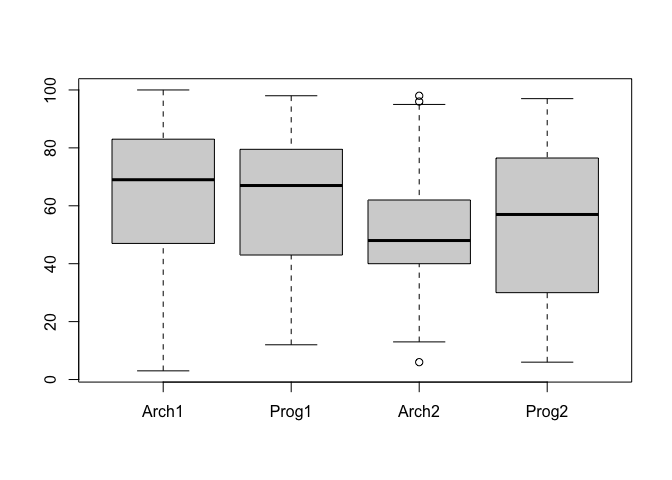
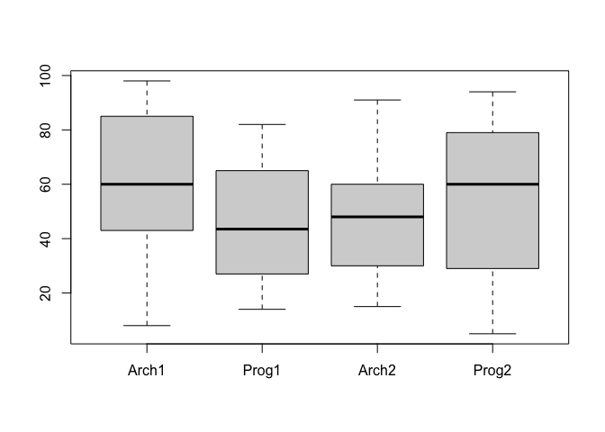

    setwd("/Users/imee/Desktop/IVAN")
    library(readr)
    results <- read.table("results.csv", header = TRUE)

    results

    ##     Gender Arch1 Prog1 Arch2 Prog2
    ## 1        M    99    98    83    94
    ## 2        M    NA    NA    86    77
    ## 3        M    97    97    92    93
    ## 4        M    99    97    95    96
    ## 5        M    89    92    86    94
    ## 6        M    91    97    91    97
    ## 7        M   100    88    96    85
    ## 8        F    86    82    89    87
    ## 9        M    89    88    65    84
    ## 10       M    85    90    83    85
    ## 11       M    50    91    84    93
    ## 12       M    96    71    56    83
    ## 13       F    98    80    81    94
    ## 14       M    96    76    59    84
    ## 15       M    73    72    91    87
    ## 16       M    67    82    80    77
    ## 17       M    80    85    94    72
    ## 18       M    91    76    85    84
    ## 19       M    89    81    77    81
    ## 20       M    77    81    88    91
    ## 21       M    71    82    59    79
    ## 22       M    84    81    88    77
    ## 23       M    95    83    92    63
    ## 24       M     3    87    56    76
    ## 25       F    95    65    63    82
    ## 26       F    NA    NA    91    65
    ## 27       M    59    79    73    82
    ## 28       M    95    83    49    69
    ## 29       M    80    80    87    72
    ## 30       M    97    92    98    96
    ## 31       M    81    89    41    57
    ## 32       M    77    70    51    71
    ## 33       M    69    74    83    68
    ## 34       M    82    79    57    45
    ## 35       F    85    66    56    67
    ## 36       M    87    68    56    78
    ## 37       M    88    76    47    61
    ## 38       M    83    76    41    65
    ## 39       M    51    67    49    79
    ## 40       F    76    63    57    76
    ## 41       M    88    64    48    53
    ## 42       M    61    53    54    61
    ## 43       M    83    60    56    49
    ## 44       M    90    78    81    50
    ## 45       M    40    67    53    68
    ## 46       M    92    61    47    64
    ## 47       M    76    69    44    59
    ## 48       M    72    61    62    56
    ## 49       F    77    53    48    60
    ## 50       M    58    52    50    73
    ## 51       M    63    62    40    48
    ## 52       M    48    73    74    53
    ## 53       M    40    75    43    52
    ## 54       M    40    40    48    62
    ## 55       M    75    67    40    45
    ## 56       F    49    61    49    44
    ## 57       M    54    47    43    52
    ## 58       M    56    55    44    55
    ## 59       M    75    40    40    51
    ## 60       M    64    86    50    81
    ## 61       F    88    40    43    83
    ## 62       M    82    66    51    63
    ## 63       M    73    64    28    54
    ## 64       F    59    28    60    51
    ## 65       M    74    57    45    61
    ## 66       M    45    69    35    40
    ## 67       M    70    52    40    43
    ## 68       M    74    29    44    52
    ## 69       M    43    25    31    14
    ## 70       M    49    69    40    24
    ## 71       M    45    29    32    25
    ## 72       M    74    71    40    46
    ## 73       M    46    56    50    28
    ## 74       M    56    52    42    57
    ## 75       M    16    33    16     9
    ## 76       M    21    25    26    12
    ## 77       M    47    56    43    16
    ## 78       M    77    60    47    62
    ## 79       M    27    40    37     6
    ## 80       M    74    13    40    18
    ## 81       F    16    14    NA    NA
    ## 82       M    14    31    14    20
    ## 83       M    23    54    48    NA
    ## 84       M    83    76    58    75
    ## 85       F    NA    15    16    NA
    ## 86       M    45    40    40    61
    ## 87       M    40    28    26     9
    ## 88       M    48    27    23    16
    ## 89       M    91    89     6    73
    ## 90       F    50    27    22    11
    ## 91       M    77    82    45    65
    ## 92       M    49    49    36    31
    ## 93       M    96    84    48    29
    ## 94       F    21    29    25     5
    ## 95       M    61    40    34    11
    ## 96       M    50    19    41    NA
    ## 97       F    68    74    30    48
    ## 98       M    50    40    51    56
    ## 99       M    69    59    25    40
    ## 100      M    60    36    40    28
    ## 101      F    43    14    NA    NA
    ## 102      M    43    30    40    14
    ## 103      M    47    68    43    34
    ## 104      F    60    47    40    NA
    ## 105      M    40    68    57    75
    ## 106      M    45    26    38     6
    ## 107      M    45    31    NA    NA
    ## 108      F    31    21    32     8
    ## 109      M    49    12    24    14
    ## 110      M    87    40    40    32
    ## 111      M    40    76    49    17
    ## 112      F     8    29    15    14
    ## 113      M    62    46    50    31
    ## 114      M    14    21    NA    NA
    ## 115      M     7    25    27     7
    ## 116      M    16    27    25     7
    ## 117      M    73    51    48    23
    ## 118      M    56    54    49    25
    ## 119      M    46    64    13    19

1.  

<!-- -->

    skewness <- function(x){
      (3*(mean(x, na.rm = TRUE) - median(x, na.rm = TRUE)))/sd(x, na.rm = TRUE)
    }

    skewness(results$Arch1)

    ## [1] -0.6069042

    skewness(results$Prog1)

    ## [1] -0.643229

    skewness(results$Arch2)

    ## [1] 0.5421286

    skewness(results$Prog2)

    ## [1] -0.3562908

2.a.

    M <- c(results$Arch1[results$Gender == "M"], results$Arch2[results$Gender == "M"],results$Prog1[results$Gender == "M"], results$Prog2[results$Gender == "M"])
    stem(M)

    ## 
    ##   The decimal point is 1 digit(s) to the right of the |
    ## 
    ##    0 | 3
    ##    0 | 66677799
    ##    1 | 12233444444
    ##    1 | 666667899
    ##    2 | 01133344
    ##    2 | 555555566677778888999
    ##    3 | 01111122344
    ##    3 | 56678
    ##    4 | 0000000000000000000000000011123333333444
    ##    4 | 555555555666677777788888888999999999
    ##    5 | 00000000111111222222333344444
    ##    5 | 5566666666666777778899999
    ##    6 | 000111111112222233344444
    ##    6 | 5556777788888999999
    ##    7 | 00111122223333333444444
    ##    7 | 555556666666677777777889999
    ##    8 | 00001111111222222333333333444444
    ##    8 | 555556667777788888899999
    ##    9 | 0011111112222233444
    ##    9 | 5556666667777778899
    ##   10 | 0

    A <- c(results$Arch1[results$Gender == "F"], results$Arch2[results$Gender == "F"],results$Prog1[results$Gender == "F"], results$Prog2[results$Gender == "F"])
    stem(A)

    ## 
    ##   The decimal point is 1 digit(s) to the right of the |
    ## 
    ##   0 | 588
    ##   1 | 14445566
    ##   2 | 11257899
    ##   3 | 012
    ##   4 | 0033478899
    ##   5 | 013679
    ##   6 | 00013355678
    ##   7 | 4667
    ##   8 | 0122356789
    ##   9 | 1458

Displaying the data this way allows the viewer to see the specific
scores from each increment. It also displays the frequency of data.

2.b.

    MM <- results[results[, 1] == "M", 2:5]
    boxplot(MM)

Subjects Arch1, Prog1, and Prog2 all are skewed towards the lower end
which agrees with the calculated value of skewness in number 1 even if
the data used above are for the M gender. Arch2 has a few outliers and
is skewed to the higher end.

    FF <- results[results[, 1] == "F", 2:5]
    boxplot(FF)

Unlike the M plot, Prog1 for the F gender shows the data being skewed
towards the high end. This contradicts the calculated skewedness for all
data. Arch2 is also skewed towards the high end while Arch1 and Prog2
are skewed towards the low end which agrees with the calculated
skewedness.
