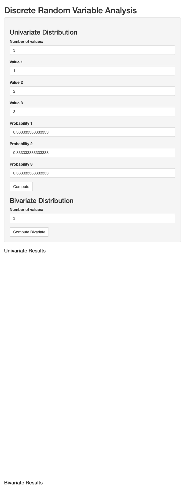
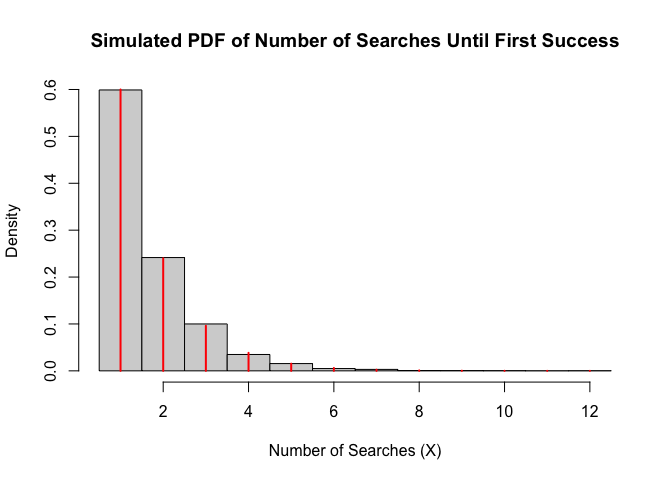

1.A company has three factories producing a product. Factory 1 produces
*x*1 of the product, factory 2 produces *x*2, and
factory 3 produces *x*3, where

$$
\sum\_{i=1}^{3} x\_i = 1.
$$

The defective rates of the products are
*y*1, *y*2, and *y*3 respectively,
where

$$
\sum\_{i=1}^{3} y\_i = 0.12.
$$

Write a program (user input for *x**i* and *y**i*)
to calculate the probability that a randomly selected product is
defective.

Your program should render a prompt message to satisfy the following
conditions:

-   0.10 ≤ *x**i* ≤ 0.40 or 10% ≤ *x**i* ≤ 40%,
    and

$$
\sum\_{i=1}^{3} x\_i = 1.
$$

-   0.01 ≤ *y**i* ≤ 0.05 or 1% ≤ *y**i* ≤ 5%, and

$$
\sum\_{i=1}^{3} y\_i = 0.12.
$$

    calculate_defective_probability <- function(x1, x2, x3, y1, y2, y3) {
      # Open a file connection to save output (optional)
      sink("output.txt", append = TRUE, split = TRUE)
      
      # Print prompts and inputs
      cat("Enter the proportion of products from each factory (between 10% and 40%):\n")
      cat(sprintf("Proportion from Factory 1 (x1): %.2f\n", x1))
      cat(sprintf("Proportion from Factory 2 (x2): %.2f\n", x2))
      cat(sprintf("Proportion from Factory 3 (x3): %.2f\n", x3))

      # Validate proportions
      if (any(x1 < 0.10 | x1 > 0.41, x2 < 0.10 | x2 > 0.41, x3 < 0.10 | x3 > 0.41)) {
        stop("Error: Each x_i must be between 10% and 40%.")
      }
      if (abs(sum(x1, x2, x3) - 1) > 0.001) {
        stop("Error: The sum of x1, x2, and x3 must be 1.")
      }

      # Print prompts and inputs for defective rates
      cat("\nEnter the defective rate for each factory (between 1% and 5% as percentages):\n")
      cat(sprintf("Defective rate for Factory 1 (y1): %.0f%%\n", y1))
      cat(sprintf("Defective rate for Factory 2 (y2): %.0f%%\n", y2))
      cat(sprintf("Defective rate for Factory 3 (y3): %.0f%%\n", y3))

      # Convert defective rates to decimals
      y1 <- y1 / 100
      y2 <- y2 / 100
      y3 <- y3 / 100

      # Validate defective rates
      if (any(y1 < 0.01 | y1 > 0.05, y2 < 0.01 | y2 > 0.05, y3 < 0.01 | y3 > 0.05)) {
        stop("Error: Each y_i must be between 1% and 5%.")
      }
      if (abs(sum(y1, y2, y3) - 0.12) > 0.001) {
        stop("Error: The sum of y1, y2, and y3 must be 12% (0.12).")
      }

      # Calculate probability
      probability_defective <- x1 * y1 + x2 * y2 + x3 * y3
      cat(sprintf("\nThe probability that a randomly selected product is defective is: %.4f or %.2f%%\n", 
                  probability_defective, probability_defective * 100))

      # Close the sink
      sink()
      
      # Return the probability (optional, for further use)
      return(probability_defective)
    }
    calculate_defective_probability(.3,.3,.4,5,5,2)

    ## Enter the proportion of products from each factory (between 10% and 40%):
    ## Proportion from Factory 1 (x1): 0.30
    ## Proportion from Factory 2 (x2): 0.30
    ## Proportion from Factory 3 (x3): 0.40
    ## 
    ## Enter the defective rate for each factory (between 1% and 5% as percentages):
    ## Defective rate for Factory 1 (y1): 5%
    ## Defective rate for Factory 2 (y2): 5%
    ## Defective rate for Factory 3 (y3): 2%
    ## 
    ## The probability that a randomly selected product is defective is: 0.0380 or 3.80%

    ## [1] 0.038

2.With your own computing experience, develop a front end to R that
allows the user:

-   To input the values of a univariate discrete random variable and the
    associated probabilities and to obtain the mean and variance.
-   To input the values of a bivariate discrete random variable and the
    associated probabilities and to obtain the marginal and conditional
    distributions.

Your program should provide a facility to calculate the mean and
variance of each distribution, and to plot the probability density
function (pdf) and cumulative distribution function (cdf).

In each program, do validity checks that the probabilities are in the
interval \[0, 1\], and that they sum to one.

    library(shiny)

    ui <- fluidPage(
      titlePanel("Discrete Random Variable Analysis"),
      sidebarLayout(
        sidebarPanel(
          h3("Univariate Distribution"),
          numericInput("n", "Number of values:", min = 1, value = 3),
          uiOutput("values_ui"),
          uiOutput("probs_ui"),
          actionButton("compute", "Compute"),
          
          h3("Bivariate Distribution"),
          numericInput("n_bi", "Number of values:", min = 1, value = 3),
          uiOutput("values_bi_ui"),
          uiOutput("probs_bi_ui"),
          actionButton("compute_bi", "Compute Bivariate")
        ),
        mainPanel(
          h4("Univariate Results"),
          verbatimTextOutput("uni_summary"),
          plotOutput("uni_pdf"),
          plotOutput("uni_cdf"),
          
          h4("Bivariate Results"),
          verbatimTextOutput("bi_summary")
        )
      )
    )

    server <- function(input, output, session) {
      
      output$values_ui <- renderUI({
        lapply(1:input$n, function(i) {
          numericInput(paste0("val", i), paste("Value", i), value = i)
        })
      })
      
      output$probs_ui <- renderUI({
        lapply(1:input$n, function(i) {
          numericInput(paste0("prob", i), paste("Probability", i), value = 1/input$n, min = 0, max = 1)
        })
      })
      
      observeEvent(input$compute, {
        values <- sapply(1:input$n, function(i) input[[paste0("val", i)]])
        probs <- sapply(1:input$n, function(i) input[[paste0("prob", i)]])
        
        if (sum(probs) != 1) {
          output$uni_summary <- renderText("Error: Probabilities must sum to 1")
        } else {
          mean_val <- sum(values * probs)
          var_val <- sum((values - mean_val)^2 * probs)
          
          output$uni_summary <- renderText({
            paste("Mean:", round(mean_val, 3), "Variance:", round(var_val, 3))
          })
          
          output$uni_pdf <- renderPlot({
            barplot(probs, names.arg = values, main = "Probability Mass Function", col = "blue")
          })
          
          output$uni_cdf <- renderPlot({
            plot(values, cumsum(probs), type = "s", main = "Cumulative Distribution Function", col = "red", lwd = 2)
          })
        }
      })
    }

    shinyApp(ui, server)

    ## 
    ## Listening on http://127.0.0.1:8363

    p <- 0.6
    n_sim <- 10000

    X <- rgeom(n_sim, prob = p) + 1

    hist(X, 
         prob = TRUE, 
         breaks = seq(0.5, max(X) + 0.5, by = 1), 
         main = "Simulated PDF of Number of Searches Until First Success",
         xlab = "Number of Searches (X)",
         ylab = "Density")

    x_values <- 1:max(X)
    pmf <- (1 - p)^(x_values - 1) * p
    lines(x_values, pmf, type = "h", col = "red", lwd = 2)

    mean_X <- mean(X)
    var_X <- var(X)

    cat("Sample Mean:", mean_X, "\n")

    ## Sample Mean: 1.6595

    cat("Sample Variance:", var_X, "\n")

    ## Sample Variance: 1.070067

    X_cond <- X[X > 3]
    mean_cond <- mean(X_cond)
    var_cond <- var(X_cond)

    cat("Conditional Mean (X > 3):", mean_cond, "\n")

    ## Conditional Mean (X > 3): 4.66835

    cat("Conditional Variance (X > 3):", var_cond, "\n")

    ## Conditional Variance (X > 3): 1.078693

    p_x4_given_x3 <- mean(X == 4) / mean(X > 3)
    p_x1 <- p
    cat("P(X = 4 | X > 3):", p_x4_given_x3, "\n")

    ## P(X = 4 | X > 3): 0.5875421

    cat("P(X = 1):", p_x1, "\n")

    ## P(X = 1): 0.6

    p_x5_given_x3 <- mean(X == 5) / mean(X > 3)
    p_x2 <- (1 - p) * p
    cat("P(X = 5 | X > 3):", p_x5_given_x3, "\n")

    ## P(X = 5 | X > 3): 0.2609428

    cat("P(X = 2):", p_x2, "\n")

    ## P(X = 2): 0.24
